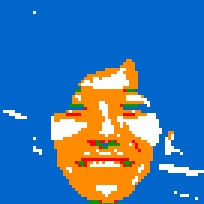

【使い方】
ディレクトリを作ってください。
ディレクトリ内にpythonファイルを作り、ここのrubikimage.pyの内容をコピーしてください。
同じディレクトリ内に加工したい画像を持ってきてください。
※jpeg画像のみ使用できます。注意！！

シェルかコマンドプロンプトで同ディレクトリに移動してください。
python rubikimage.py
で実行されるとヘルプが表示されます。
  -s S        ソースファイル名を指定
  -d D        書き出すファイル名を指定
  -m M        モザイクのサイズを指定:default=100
python rubikimage.py -s test.jpeg -d test200.jpeg -m 200
でモザイクの大きさが200の変換が実行され、test200.jpegが生成されます。

【ルーブックキューブの色を変えたい場合】
rubikimage.pyの__ave_rgb関数にあるcolorsの要素部分の数値を変えてください。

